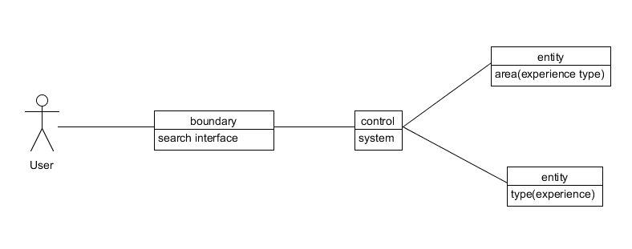
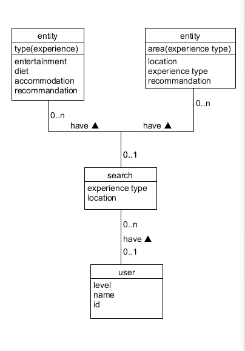
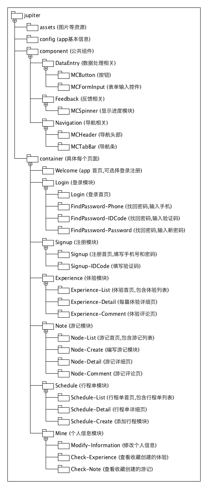

## 软件设计文档
### UI design
- [登录注册用例原型文件](https://pan.baidu.com/s/1LtsWomA5lpZ50qMbJgSygg) UI原型文件【密码：ak7k】（必须手动下载才能预览）

---
### Database design
- [Database design](https://github.com/jupiter-sysu/jupiter-be/wiki/Database-Documentation)

---
### API设计
[API设计](https://apizza.net/console/project/d219e15359947f0ce7411b7b91fd5668/browse)

---
### 用到的技术
- React
- React Native
- Ant design
- PHP
- Mobx

---
### BCE




---
### 技术选型理由

#### 服务端
**PHP的原因**
1. 上手容易，语法容易掌握(服务端小组都是第一次接触后段)
2. 与我们所选择的的mySQL数据库有这较好的契合度
3. 拥有许多功能强大的与前端需求相契合的函数与库
4. 可以较为方便的获取前端发来的http请求

#### 前端
**React的原因：**
1. View 层框架。
- 数据试图分离，数据规模大的项目开发便捷。
- 虚拟 dom，diff 渲染，性能高效。

2. 组件化
- 标签化的组件表达方式，清晰。

3. 三端
- 这也许是 React 最吸引人的地方了。一套代码，三端生产。

4. 分工
- 因为组件化所以分工可以很高效

**RN的原因呢**
1. 比较好的 View 处理方式
2. 两端统一
3. 组件比较多
4. 比原生的开发成本要降低

---
### 架构设计
#### 前端
**FLUX**
一个 Flux 应用主要包含四个部分：
- the dispatcher
处理动作分发，维护 Store 之间的依赖关系
- the stores
数据和逻辑部分
- the views
React 组件，这一层可以看作 controller-views，作为视图同时响应用户交互
- the actions
提供给 dispatcher 传递数据给 store

我们选择Mobx来实现类Flux的架构，具体的流程如下：


我们的View部分都放在`Containers`文件夹，也就是React的模版语言。我们尽可能在这里不写过多的业务逻辑，只做展示型的组件。然后通过`Store`文件夹来管理状态。在Mobx中，我们可以把action、state、computed values写在同一个页面内，这样的好处就是比较直观，不会像Redux那样需要写更多的东西。所有的状态都是单向流动的，不会像MVC一样有很多的Controller可以改变Model，数据状态混乱不堪。

Mobx还有一个非常好的优势就是支持异步dispatch，这个是很好用的一个东西，在redux中要用一个嵌套的写法来完成异步，而Mobx则可以直接使用ES7的async，非常直观。

####服务器端
由于我们服务器端只需要按照前端的需求来设计出相应的api接口，所以我们服务端的构架就是通过前端的功能流程图，我们将服务端的相关api接口按照负责功能的不同来分类，所以我们将我们的服务端api接口分为以下几个部分：
1. data部分，用于处理我们后台管理系统来增删改查Jupiter相关数据。
2. experience部分，用于处理体验功能的api模块
3. signup部分，用于处理用户注册的api模块
4. login部分，用于处理用户登录的api模块
5. modify部分，用于处理修改密码的api模块
6. search部分，用于处理搜索相关体验的api模块
7. token部分，用于七牛云服务器图片文件上传的api模块

---
### 设计模式
#### 前端
**1. 使用受控组件**
React 组件可以是有状态的，在其生命周期内可以操纵并改变其内部状态；

React 组件也可以是无状态的，它仅接受来自父组件传入的 props，并进行展示。

我们使用Antd的组件，他的组件可以选择受控或者非受控，我们趋向于选择受控组件，这样子更好的管理状态。

下面是一个无状态的 Button 组件，它的行为完全由传入的 props 决定：
```javascript
const Button = props => 
  <button onClick={props.onClick}>
    {props.text}
  </button>
```
下面是一个有状态组件(使用了上述的无状态组件):
```javascript
class ButtonCounter extends React.Component {
  constructor() {
    super();
    this.state = { clicks: 0 };
    this.handleClick = this.handleClick.bind(this);
  }

  handleClick() {
    this.setState({ clicks: ++this.state.clicks });
  }

  render() {
    return (
      <Button
        onClick={this.handleClick}
        text={`You've clicked me ${this.state.clicks} times !`}
      />
    )
  }
}
```
正如你所看到的，上述 ButtonCounter 组件在 state 中维护了自己的状态，而之前的 Button 组件仅根据 props 来进行渲染展示。这个区别看似很小，但是无状态的 Button 组件却高度可复用。

**2.使用高阶组件HOC**
当你想复用一个组件的逻辑时，高阶组件(HOC)就派上用场了。高阶组件就是 JavaScript 函数，接收 React 组件作为参数，并返回一个新组件。

我们编写了一个未登录返回登录页的高阶组件，以此来复用业务逻辑。
具体的写法如下：
```javascript
// This function takes a component...
export default function LoginRedirect(path: String) {
  // ...and returns another component...
  return WrappedComponent =>
    observer(class extends React.Component {
      render() {
        const { isLogin, ...otherProsp } = this.props;
        if (!isLogin) {
          return <WrappedComponent {...otherProsp} />
        }
        return (
          <Redirect
            to={{
                pathname: path,
                state: { from: this.props.location },
              }}
          />
        );
      }
    });
}
```
使用的方法就是在要使用的组件引入这个函数，然后使用decorator修饰组件。
```javascript
@unLoginRedirect('/login')
@observer
class Message extends Component<PropType> {
    ...
}
```

**服务端**
**1. 简单工厂模式**
服务端的接口实现都依照简单工厂模式。服务端根据前端传送的参数进行对应的操作，最后返回对应的响应包。服务端充当工厂的角色，前端只需按照约定的接口传输数据就能得到响应。
```php
// read from post
$post_body = file_get_contents('php://input');
$post_body_json = json_decode($post_body);
$review_id = $post_body_json->review_id;
$page_num = $post_body_json->page_num;

if ($page_num == 0) {

    //query by infomation in post
    $res = mysql_query("SELECT * FROM experience_review_info_temp WHERE experience_review_id=" . $review_id);
    $row = $res ? mysql_fetch_assoc($res) : null;

    // create response
    if ($row != null) {
        $user_id = $row['user_id'];
        $res1 = mysql_query("SELECT * FROM user_info_temp WHERE user_id=" . $user_id);
        $row1 = $res1 ? mysql_fetch_assoc($res1) : null;
        $data['user_name'] = $row1['user_name'];
        $data['user_profile_img'] = $row1['profile_picture'];
        $data['review_date'] = $row['create_at'];
        for ($count = 1; ($count<=3)&&($row['feature' . $count] != null); $count++) {
            $data['review_tags'][$count-1] = $row['feature' . $count];
        }
        $data['star_rank'] = $row['star_rank'];
        $data['review_text'] = $row['experience_review_text'];
        for ($count = 1; ($count<=9)&&($row['photo' . $count] != null); $count++) {
            $data['review_imgs'][$count-1] = $row['photo' . $count];
        }
        $data['like_num'] = $row['like_num'];
        $data['comment_num'] = $row['comment_num'];
    } else {
        var_json("200", "ok", "成功", null);
    }
}
```

---
## 模块划分
**前端**
;

**服务端**
1.目录结构
2.具体的一些模块
